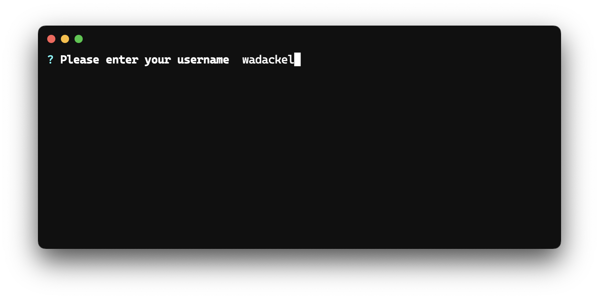
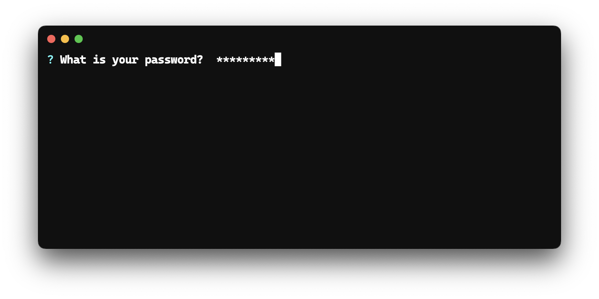
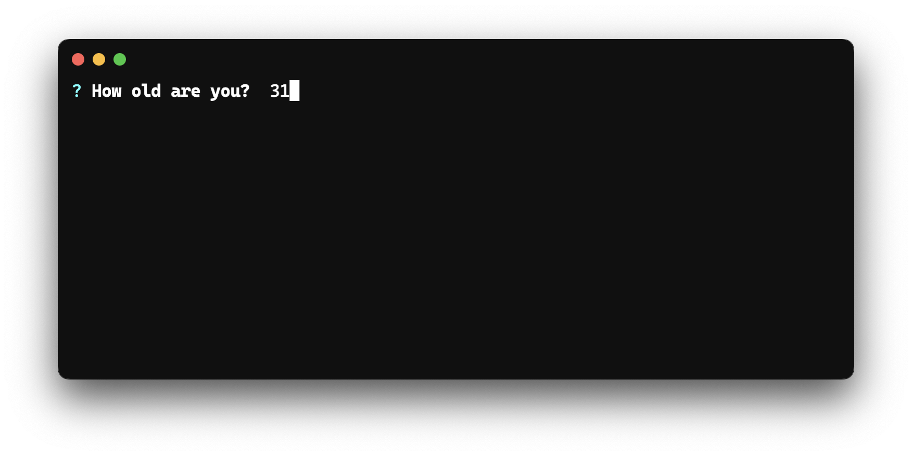
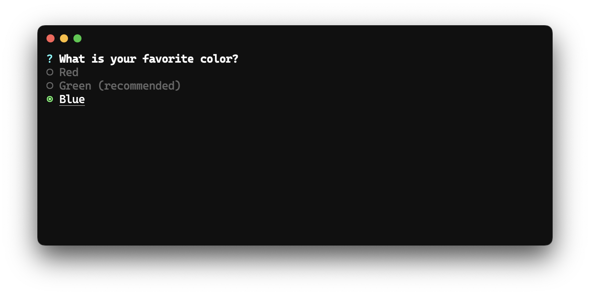
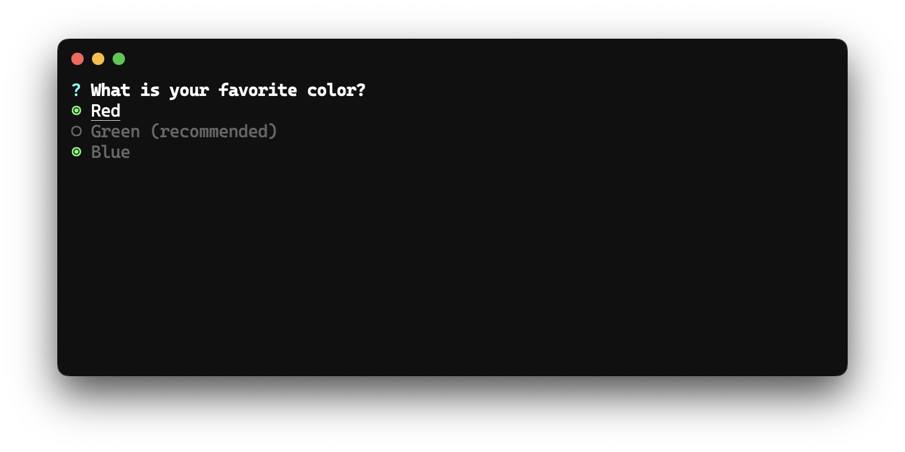
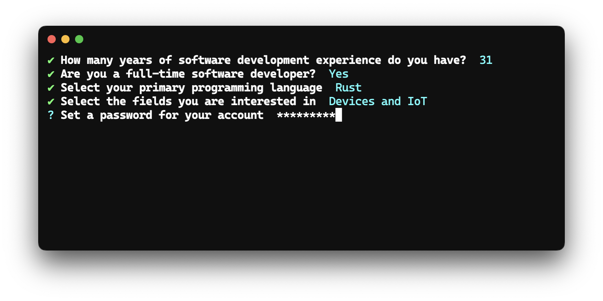
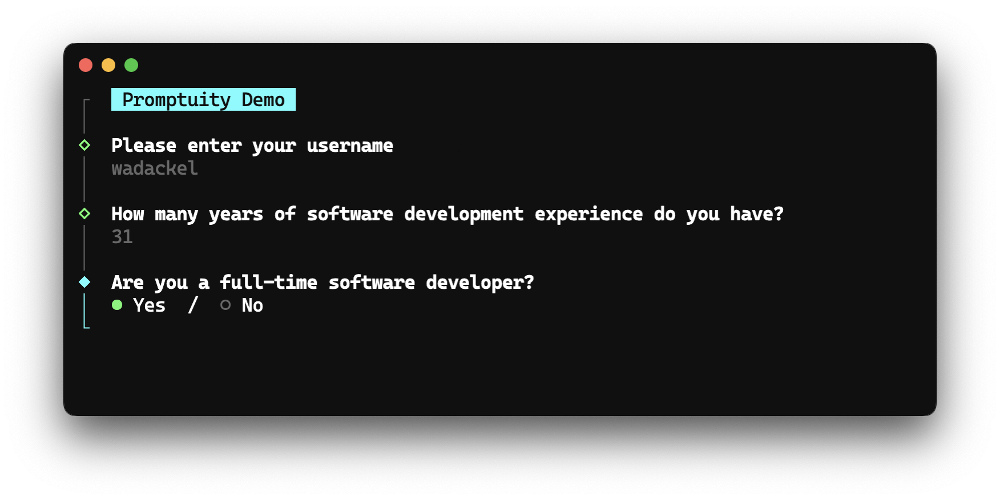

<h1 align="center">Promptuity</h1>
<p align="center"><small>Promptuity = Prompt + Ingenuity</small></p>
<p align="center">
    <a href="https://github.com/wadackel/promptuity/actions/workflows/ci.yml?query=branch%3Amain"></a>
    <a href="https://crates.io/crates/promptuity/"></a>
    <a href="https://docs.rs/promptuity"></a>
    <a href="https://github.com/wadackel/promptuity/blob/main/LICENSE"></a>
</p>
<p align="center">Promptuity is a library that provides interactive prompts. It is highly extensible, allowing you to build your original prompts from scratch. It brings <strong>ingenuity</strong> to various projects.</p>

## Concept

- :zap: **Not easy, But simple**
    - Avoids APIs with implicit behavior, aiming to provide as transparent APIs as possible.
    - The amount of code required to start a prompt may be more compared to other libraries.
- :hammer: **Extensible**
    - You can customize built-in prompts or build your prompts from scratch.
    - The built-in prompts are minimal, assuming that prompt requirements vary by project.
- :nail_care: **Beautiful**
    - Offers two types of built-in Themes.
    - Themes can also be fully customized to fit your ideal.

## Quick Start


The basic usage is as follows.

```rust
use promptuity::prompts::{Confirm, Input, Select, SelectOption};
use promptuity::themes::FancyTheme;
use promptuity::{Error, Promptuity, Term};

fn main() -> Result<(), Error> {
    let mut term = Term::default();
    let mut theme = FancyTheme::default();
    let mut p = Promptuity::new(&mut term, &mut theme);

    p.term().clear()?;

    p.with_intro("Survey").begin()?;

    let name = p.prompt(Input::new("Please enter your username").with_placeholder("username"))?;

    let _ = p.prompt(Confirm::new("Are you a full-time software developer?").with_default(true))?;

    let _ = p.prompt(
        Select::new(
            "Select your primary programming language",
            vec![
                SelectOption::new("Rust", "rust"),
                SelectOption::new("Go", "go"),
                SelectOption::new("C++", "cpp"),
                SelectOption::new("C", "c"),
                SelectOption::new("TypeScript", "typescript"),
                SelectOption::new("JavaScript", "javascript"),
                SelectOption::new("Deno", "deno"),
                SelectOption::new("Python", "python"),
                SelectOption::new("Java", "java"),
                SelectOption::new("Dart", "dart"),
                SelectOption::new("Other", "other"),
            ],
        )
        .with_hint("Submit with Space or Enter."),
    )?;

    p.with_outro(format!("Thank you for your response, {}!", name))
        .finish()?;

    Ok(())
}
```

## Examples

If you want to see more examples, please refer to the [examples](./examples/) directory.

## Documentation

Please refer to the [documentation](https://docs.rs/promptuity).

## Prompts

[`promptuity::prompts`](https://docs.rs/promptuity/latest/promptuity/prompts/index.html) offers five built-in prompts.  
To implement your original prompt, please see the [Build your own Prompt](#build-your-own-prompt) section.

### Input



A prompt for general text input.

```rust
let name = p.prompt(Input::new("What is your accout name?").with_hint("e.g. wadackel"))?;
```

### Password



A text input prompt where the input is not displayed.

```rust
let secret = p.prompt(Password::new("What is your password?").with_required(false))?;
```

### Number



A prompt for inputting only integer values.

```rust
let age = p.prompt(Number::new("How old are you?").with_min(0).with_max(120))?;
```

### Select



A prompt for selecting a single element from a list of options.

```rust
let color = p.prompt(
    Select::new(
        "What is your favorite color?",
        vec![
            SelectOption::new("Red", "#ff0000"),
            SelectOption::new("Green", "#00ff00").with_hint("recommended"),
            SelectOption::new("Blue", "#0000ff"),
        ])
        .with_page_size(5)
)?;
```

### MultiSelect



A prompt for selecting multiple elements from a list of options.

```rust
let color = p.prompt(
    MultiSelect::new(
        "What is your favorite color?",
        vec![
            MultiSelectOption::new("Red", "#ff0000"),
            MultiSelectOption::new("Green", "#00ff00").with_hint("recommended"),
            MultiSelectOption::new("Blue", "#0000ff"),
        ])
        .with_page_size(5)
)?;
```

### Autocomplete

> [!NOTE]
> Autocomplete is not provided as a built-in feature. This is because the optimal behavior for Fuzzy Match and key bindings varies by project.  
> While not provided as a built-in, a reference implementation is available in [examples/autocomplete.rs](./examples/autocomplete.rs). Please adapt this to suit your project's needs.

## Themes

Promptuity offers two different built-in themes.  
To implement your original Theme, please see the [Build your own Theme](#build-your-own-theme) section.

### MinimalTheme

MinimalTheme is similar to [Inquirer](https://github.com/SBoudrias/Inquirer.js). It provides a compact UI.



### FancyTheme

FancyTheme is similar to [clack](https://github.com/natemoo-re/clack). It provides a rich UI.



## Customize

This section provides guidance on how to construct original prompts and Themes.

### Build your own Prompt

Creating an original prompt can be achieved by implementing the [`Prompt`](https://docs.rs/promptuity/latest/promptuity/trait.Prompt.html) trait. By implementing three lifecycle methods, you can build prompts that are usable with [`Promptuity::prompt`](https://docs.rs/promptuity/latest/promptuity/struct.Promptuity.html#method.prompt).

Promptuity prompts consist of the following elements:

| Item | Description |
| :-- | :-- |
| **Message** | Displays the question content of the prompt. |
| **Input** | A single-line item that accepts user key inputs. |
| **Body** | A multi-line item that accepts user key inputs. |
| **Hint** | Displays a message to assist with prompt input. |

- Prompts that accept single-line inputs, like `Input` or `Password`, do not utilize **Body**.
- Prompts that do not accept inputs, like `Select` or `MultiSelect`, do not utilize **Input**.

Keep these points in mind when building your prompts.

#### 0. Setting Up a Custom Prompt

Let's use the implementation of a custom prompt similar to `Confirm` as an example.

```rust
use promptuity::Prompt;

struct CustomConfirm {
    message: String,
    hint: Option<String>,
    value: bool,
}

impl<W: std::io::Write> Prompt<W> for CustomConfirm {
    type Output = bool;

    // TODO
}
```

Define a struct with a message, hint, and value. Specify the final result type in `Output`.

First, let's implement the reception of key inputs.

#### 1. Receiving Key Input

Handle key inputs in the [`Prompt::handle`](https://docs.rs/promptuity/latest/promptuity/trait.Prompt.html#tymethod.handle) method.

For example, let's implement it so that pressing <kbd>y</kbd> for Yes and <kbd>n</kbd> for No finalizes the result.

```rust
use promptuity::event::{KeyCode, KeyModifiers};
use promptuity::{Prompt, PromptState};

// ...

impl<W: std::io::Write> Prompt<W> for CustomConfirm {
    // ...

    fn handle(&mut self, code: KeyCode, modifiers: KeyModifiers) -> PromptState {
        match (code, modifiers) {
            (KeyCode::Enter, _) => PromptState::Submit,
            (KeyCode::Esc, _) | (KeyCode::Char('c'), KeyModifiers::CONTROL) => PromptState::Cancel,
            (KeyCode::Char('y'), KeyModifiers::NONE) | (KeyCode::Char('Y'), KeyModifiers::NONE) => {
                self.value = true;
                PromptState::Submit
            }
            (KeyCode::Char('n'), KeyModifiers::NONE) | (KeyCode::Char('N'), KeyModifiers::NONE) => {
                self.value = false;
                PromptState::Submit
            }
            _ => PromptState::Active,
        }
    }
}
```

You can freely combine key codes and modifiers, allowing the construction of complex prompts tailored to specific requirements.

> [!IMPORTANT]
> Commonly, prompts are interrupted with <kbd>Ctrl</kbd> + <kbd>C</kbd>, but Promptuity does not automatically handle this.  
> If the implementation is omitted, it results in a prompt that cannot be interrupted, leading to poor usability. Therefore, when building an original prompt, you must explicitly implement the interruption process yourself.

#### 2. Rendering the Prompt

Construct the rendering content in the [`Prompt::render`](https://docs.rs/promptuity/latest/promptuity/trait.Prompt.html#tymethod.render) method. Here's a simple example using only **Input** without a **Body**.

```rust
use promptuity::event::{KeyCode, KeyModifiers};
use promptuity::{Prompt, PromptState, RenderPayload};

// ...

impl<W: std::io::Write> Prompt<W> for CustomConfirm {
    // ...

    fn render(&mut self, state: &PromptState) -> Result<RenderPayload, String> {
        let payload = RenderPayload::new(self.message.clone(), self.hint.clone(), None);

        match state {
            PromptState::Submit => {
                let raw = if self.value { "Yes" } else { "No" };
                Ok(payload.input(PromptInput::Raw(raw.into())))
            }

            PromptState::Cancel => Ok(payload),

            _ => Ok(payload.input(PromptInput::Raw("Y/n"))),
        }
    }
}
```

Determine the appropriate rendering content based on the [`PromptState`](https://docs.rs/promptuity/latest/promptuity/enum.PromptState.html) returned by [`Prompt::handle`](https://docs.rs/promptuity/latest/promptuity/trait.Prompt.html#tymethod.handle). The above implementation achieves the following requirements:

- The result displays either `Yes` or `No`.
- If the prompt is interrupted, only the message is displayed.
- During user input reception, it displays `Y/n`.

#### 3. Returning Submission Results

This is the final step in constructing a custom prompt.

Implement the [`Prompt::submit`](https://docs.rs/promptuity/latest/promptuity/trait.Prompt.html#tymethod.submit) method, which returns the final value for the received key input.

```rust
impl<W: std::io::Write> Prompt<W> for CustomConfirm {
    // ...

    fn submit(&mut self) -> Self::Output {
        self.value
    }
}
```

`Prompt::submit` is a lifecycle method called immediately after `Prompt::handle` returns `PromptState::Submit`.

---

Handling key inputs and rendering based on input state form the foundation of prompt construction.

For building more complex prompts, [examples/autocomplete.rs](./examples/autocomplete.rs) should serve as a useful reference.

### Build your own Theme

Just like prompts, you can build an original Theme by implementing the `Theme` trait.

For a complete example, please refer to [examples/custom_theme.rs](./examples/custom_theme.rs).

## Error Handling

All errors are consolidated into [`promptuity::Error`](https://docs.rs/promptuity/latest/promptuity/enum.Error.html).

In many cases, prompt interruptions will need to be handled individually. Interruptions occur during user input reception, typically through inputs like <kbd>Ctrl</kbd> + <kbd>C</kbd> or <kbd>ESC</kbd>.

```rust
use promptuity::prompts::Input;
use promptuity::themes::MinimalTheme;
use promptuity::{Error, Promptuity, Term};

fn ask() -> Result<String, Error> {
    let mut term = Term::default();
    let mut theme = MinimalTheme::default();
    let mut p = Promptuity::new(&mut term, &mut theme);

    p.begin()?;
    let name = p.prompt(Input::new("Please enter your username").with_placeholder("username"))?;
    p.finish()?;

    Ok(name)
}

fn main() {
    match ask() {
        Ok(name) => println!("Hello, {}!", name),
        Err(Error::Cancel) => {}
        Err(e) => eprintln!("Error: {}", e),
    }
}
```

Prompt interruptions can be handled as `Error::Cancel`. In the above examples, no message is displayed in the event of an interruption.

## Alternatives

The Rust ecosystem contains many wonderful crates.

- [console-rs/dialoguer](https://github.com/console-rs/dialoguer)
- [axelvc/asky](https://github.com/axelvc/asky/)
- [mikaelmello/inquire](https://github.com/mikaelmello/inquire)
- [fadeevab/cliclack](https://github.com/fadeevab/cliclack)

### Inspired

Promptuity's various prompts and design have been greatly inspired by these projects. We are very grateful for their development.

- [SBoudrias/Inquirer.js](https://github.com/SBoudrias/Inquirer.js)
- [natemoo-re/clack](https://github.com/natemoo-re/clack)
- [terkelg/prompts](https://github.com/terkelg/prompts)

## Contributing

See [CONTRIBUTING.md](./CONTRIBUTING.md).

## CHANGELOG

See [CHANGELOG.md](./CHANGELOG.md).

## License

[MIT © wadackel](./LICENSE)
